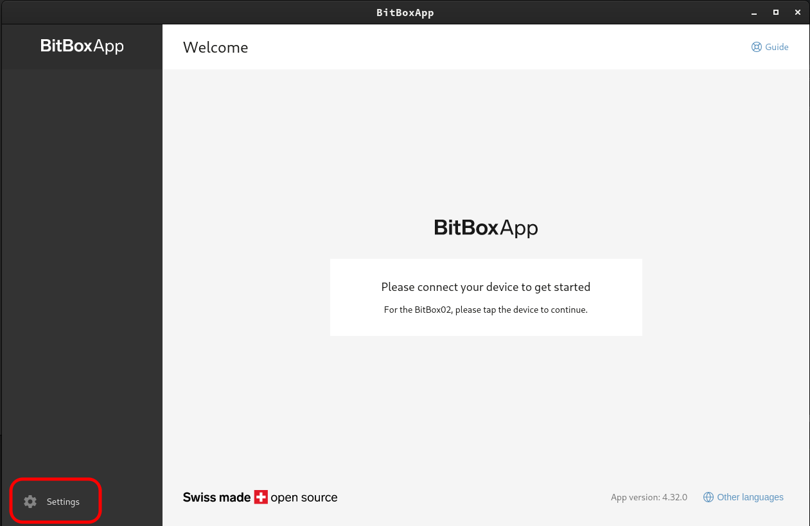
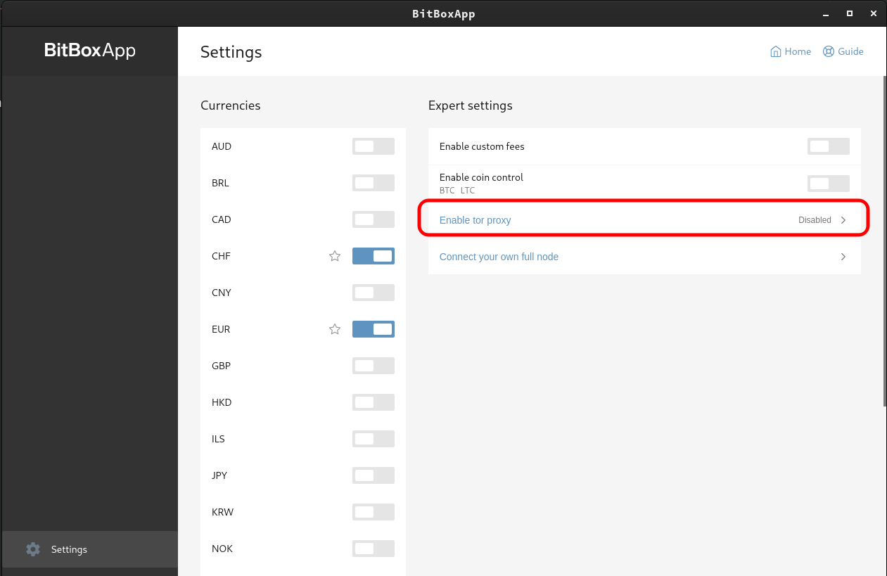
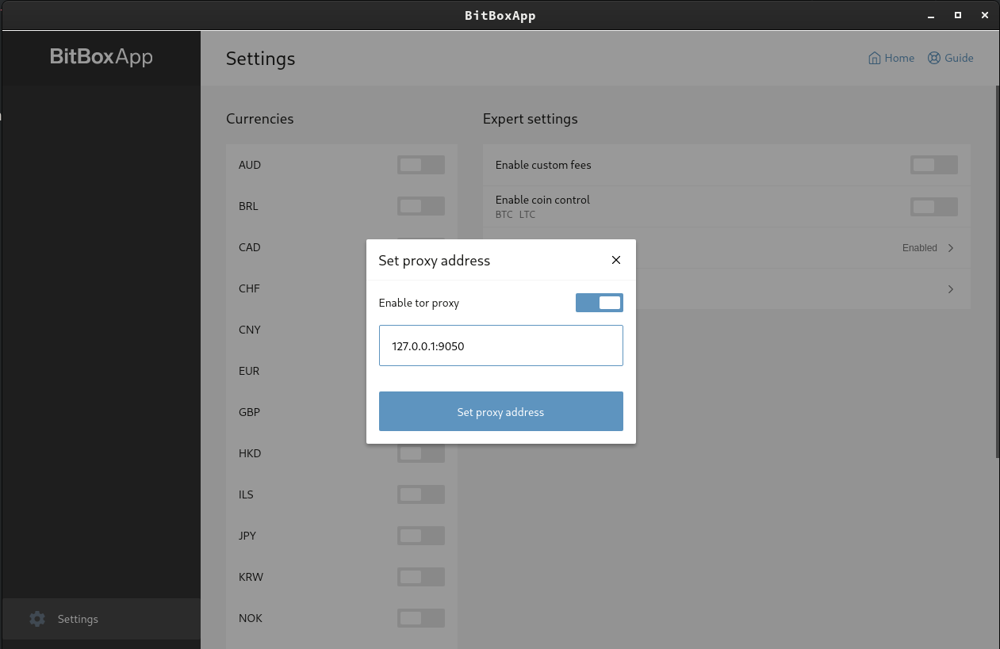
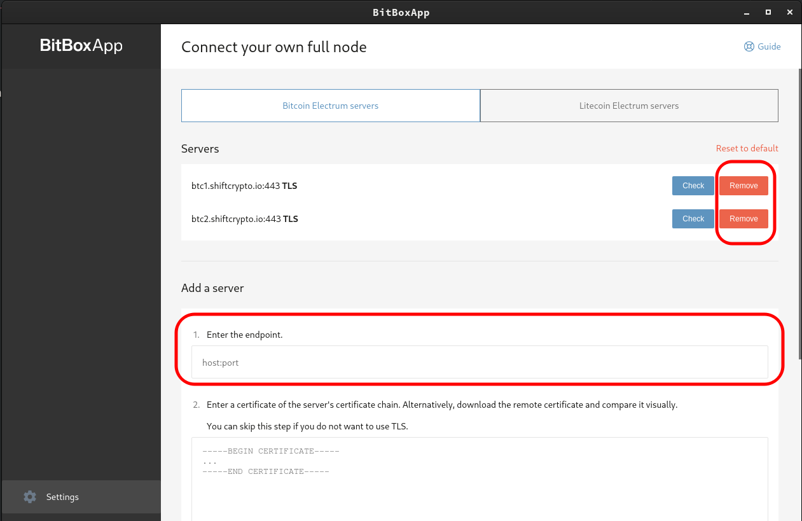
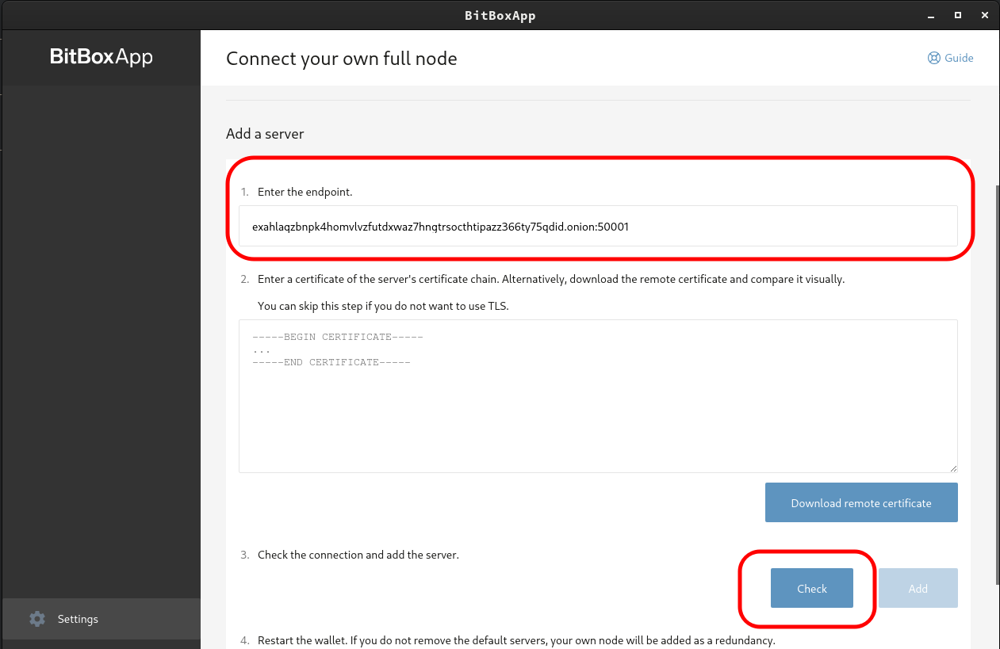
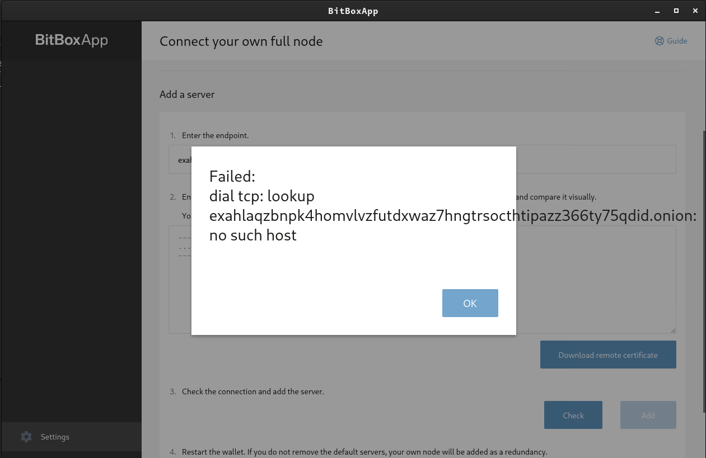
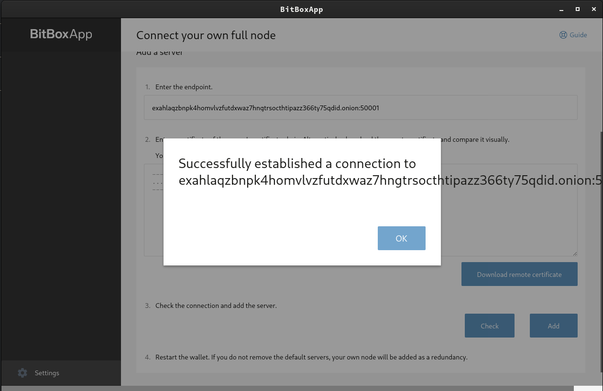

# BitBox Integration Setup

Note: You will need to be running Tor on your device, find guides to set this up here: https://start9.com/latest/user-manual/connecting/connecting-tor/tor-os/index

1. Open the BitBox App and go to "Settings"

    

1. Click "Enable Tor Proxy"

    

1. Enable the proxy and enter "127.0.0.1:9050" as the address, then click "Set Proxy Address"

    

1. Back out and click on "Connect your own full node"

    

    - Note: You may wish to remove the default servers

1. Under "Add a server," add your electrs onion address from your electrs service page (found in your Embassy's electrs service page, under "Interfaces"), followed by :50001 for the port, as shown.  Remove the "http://" prefix, or BitBox will 
give an error.  Click "Check" to test.

    

1. If you get the following error, simply restart the app (Tor has not connected) and repeat from Step 4.

    

1. You should see the following confirming a successful connection.  Click "Add" to finalize the addition of your node to BitBox.  You will then see it under the list of servers above.

    

1. Restart the app and you're ready to use BitBox!!
