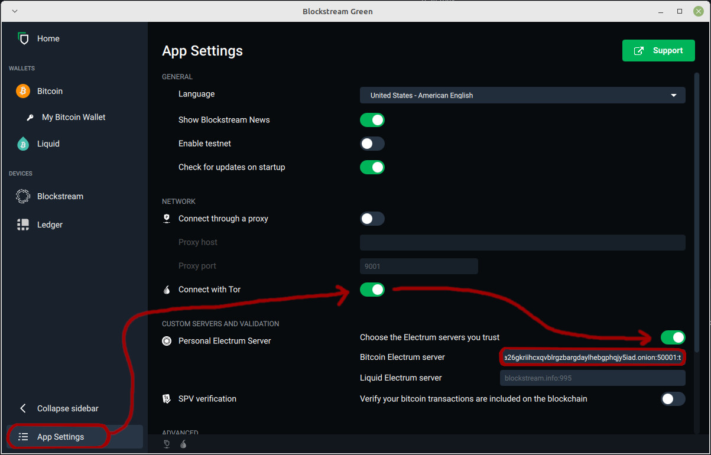

# Blockstream Green Integration Setup

1. Open Blockstream Green and select `App Settings` (bottom left)
1. Under NETWORK, enable the `Connect with Tor` toggle
1. Under CUSTOM SERVERS AND VALIDATION, enable the `Choose the Electrum servers you trust` toggle
1. In your Embassy's web interface, go to `Services > Electrs > Properties` and copy the `Quick Connect URL`
1. Paste it into the `Bitcoin Electrum server` text field of Blockstream Green

    
