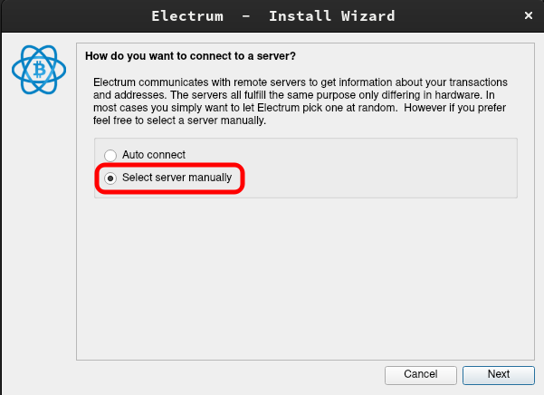
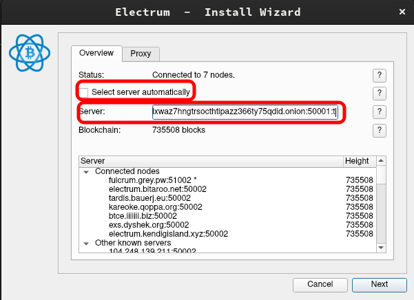
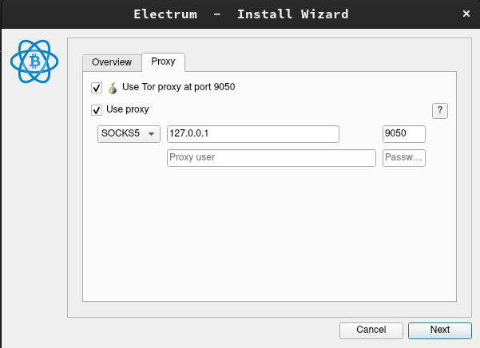
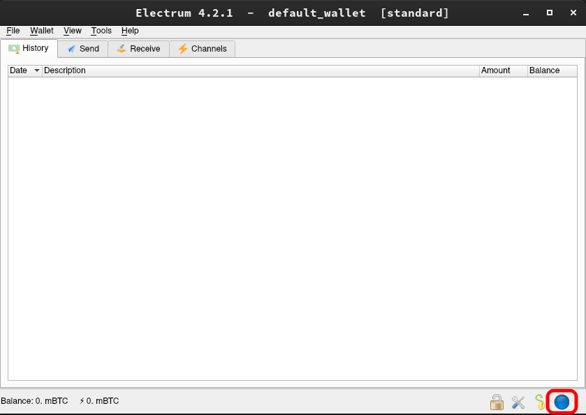

# Electrum Integration Setup

Note: You will need to be running Tor on your device, find guides to set this up here: https://start9.com/latest/user-manual/connecting/connecting-tor/tor-os/index

Caution: This will add your Electrum server, but if you want to ONLY connect to your server, you will need to run Electrum in [Single Server Mode](https://electrum.readthedocs.io/en/latest/tor.html) from the CLI.

1. Open Electrum and go to "Tools -> Network," or if you are running for the first time, choose "Select server manually," and click "Next."

    

1. On the following screen, uncheck "Select server automatically," and paste in your electrs `Quick Connect URL` (found in your Embassy web interface, under Services > Electrs > Properties).  Then click "Next."

    
    
1. Select "Use Tor" and "Use Proxy" and enter "127.0.0.1" for the address and 9050 for the port.  Click "Next."

    

1. That's it!  You will be prompted to create a wallet if this is your first time.  You can check your connection by clicking the orb in the bottom right, which should be blue in color.  If your server settings persist, you are connected.
    
    
