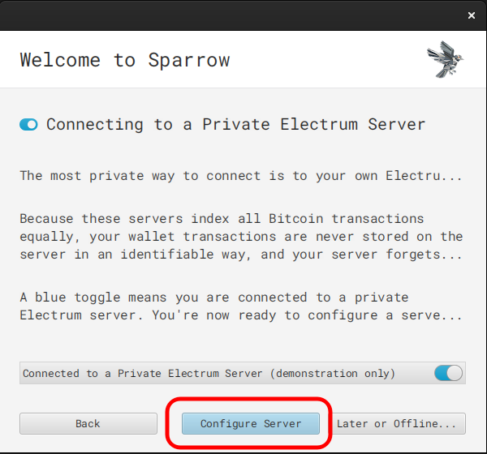
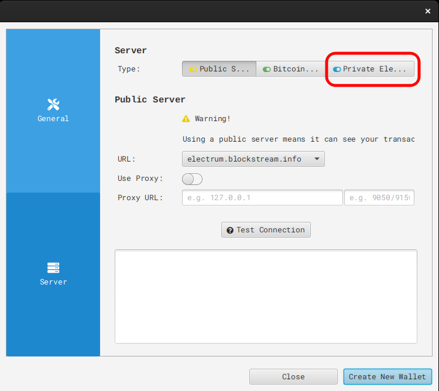
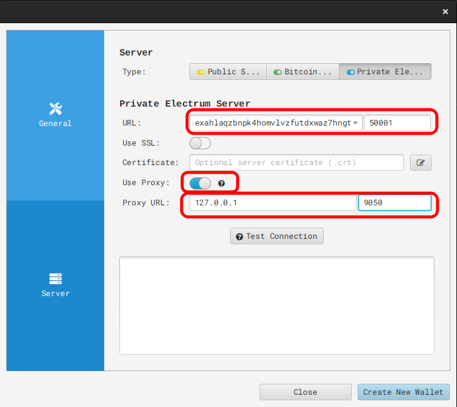
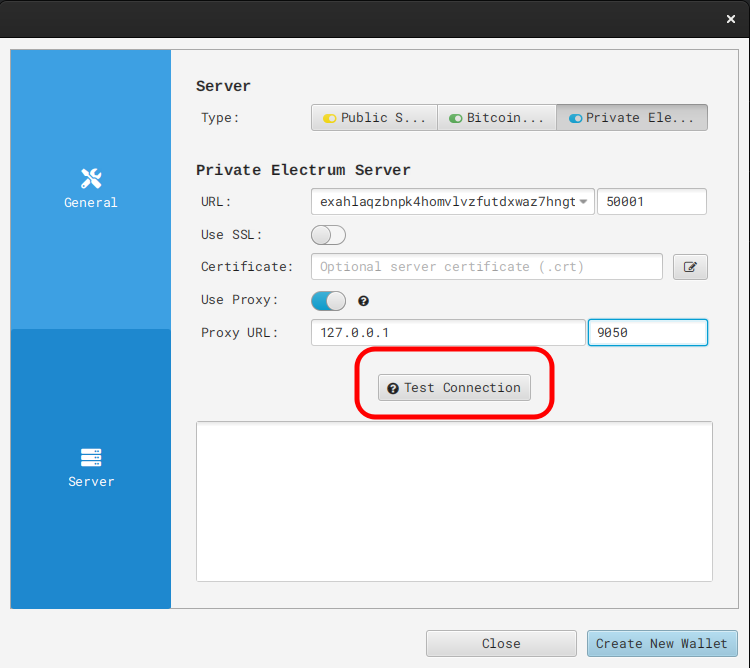
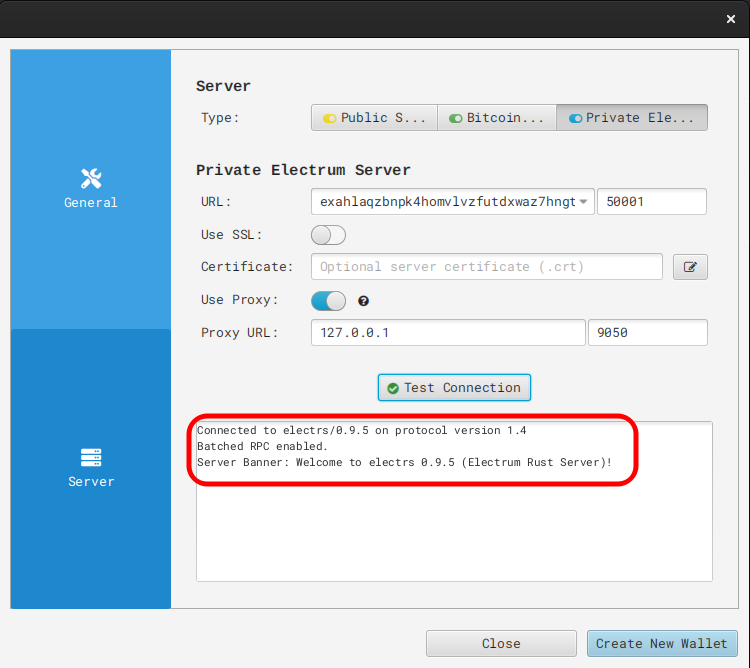

# Sparrow Integration Setup

Note: You will need to be running Tor on your device, find guides to set this up here: https://start9.com/latest/user-manual/connecting/connecting-tor/tor-os/index

1. Open Sparrow and go to "File -> Preferences -> Server," or if you are running for the first time, proceed through the introduction until the screen below.  Then select "Configure Server."

    

1. On the following screen, select "Private Electrum Server."

    
    
1. Enter your electrs Tor address (found in your Embassy's electrs service page, under "Interfaces"), removing the "http://" prefix.  Enable "Use Proxy" and then enter "127.0.0.1" for the address and "9050" for the port.

    

1. Click "Test Connection."
    
    

1. You should see the success message below, then you may return to your wallet, or proceed to create a new one.

    