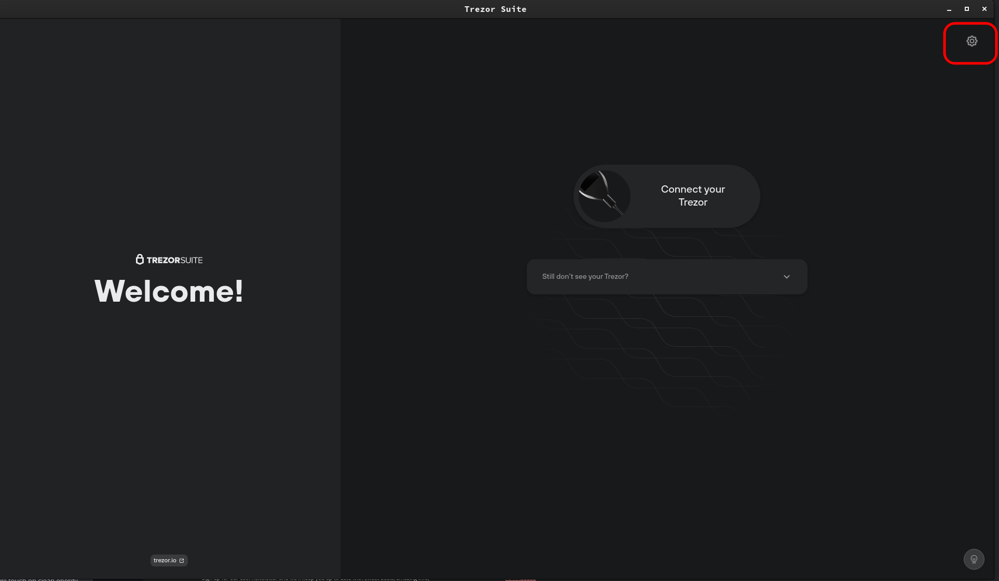
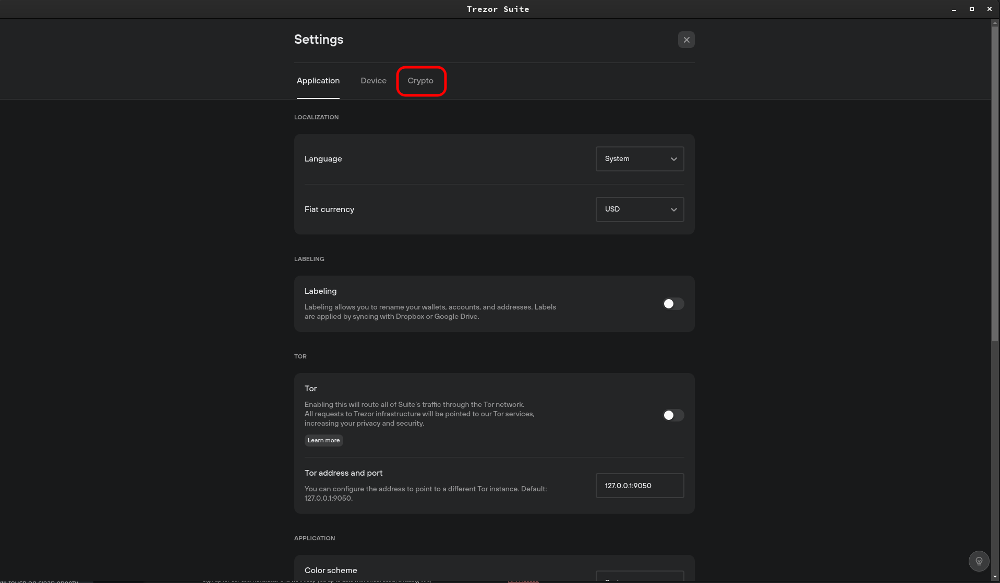
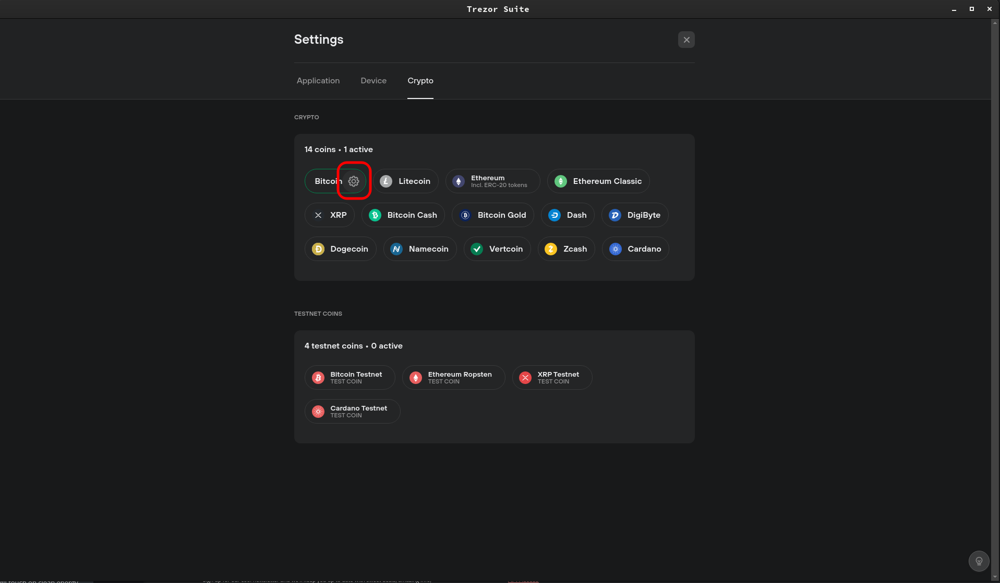
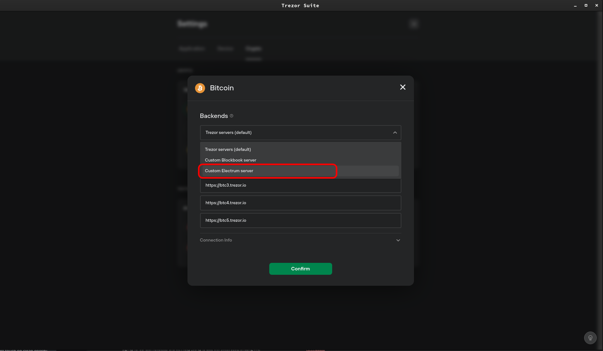
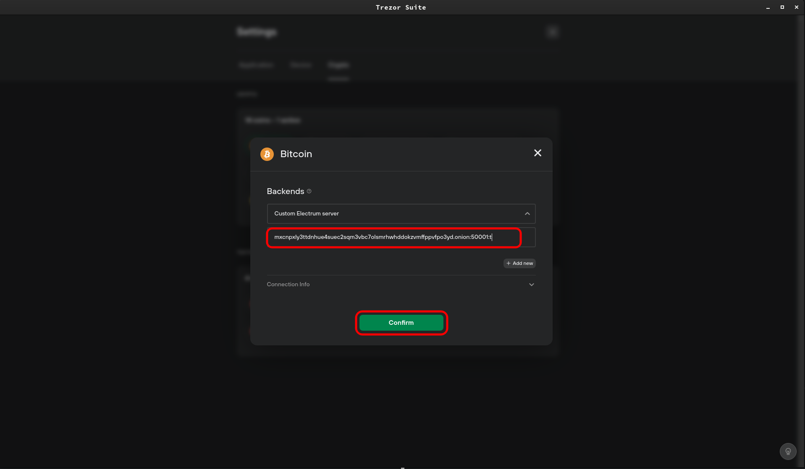
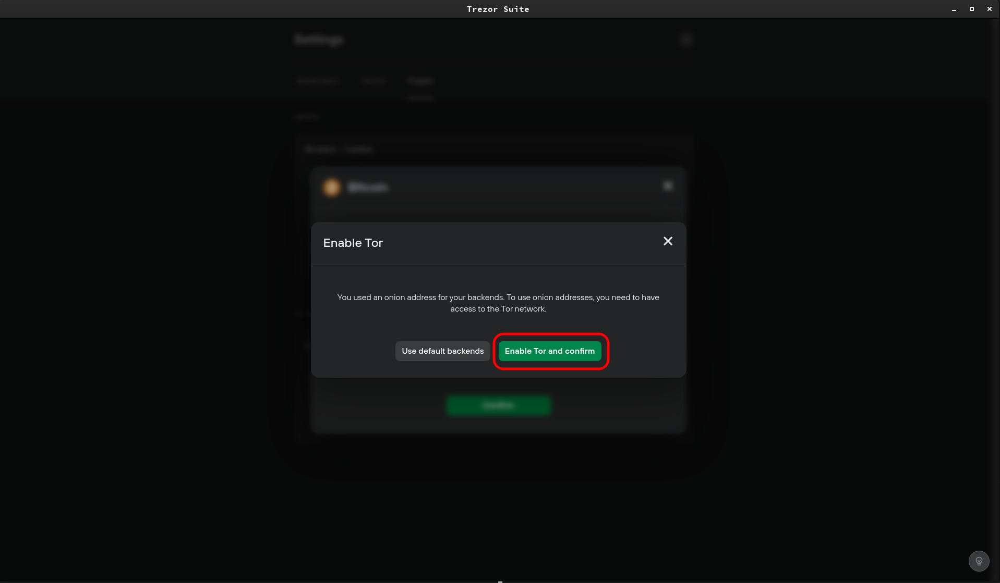

# Trezor Integration Setup

Note: You will need to be running Tor on your device, find guides to set this up here: https://start9.com/latest/user-manual/connecting/connecting-tor/tor-os/index

1. Open Trezor and click on the gear icon in the top left to enter the Settings.

    

1. On the following screen, select the "Crypto"  submenu.

    
    
1. On this screen, hover over Bitcoin to show the gear icon, then click on that icon to enter Bitcoin's Settings menu.

    

1. Under "Backends," click the dropdown menu and select "Custom Electrum Server."
    
    

1. Enter your electrs Tor address (found in your Embassy's electrs service page, under "Interfaces").  Remove the "http://" prefix, then add `:50001:t` at the end, to signify port 50001, TCP connection.  Click "Confirm."

    

1. If you have not already enabled Tor in the Trezor settings, you will be asked to do so now.  Click "Enable Tor and Confirm," and that's it!  You're now using your Embassy's Bitcoin node with your Trezor Suite!

    

    Note: If you are required to enter Tor address and port, use the default: `127.0.0.1:9050`